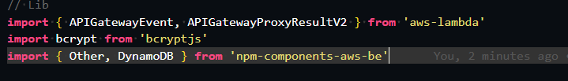
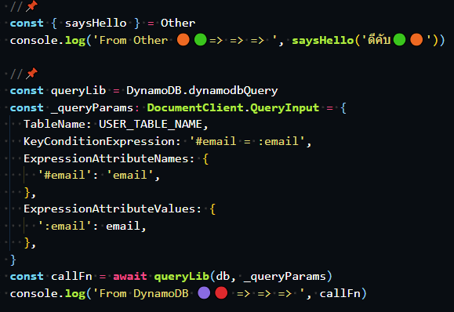
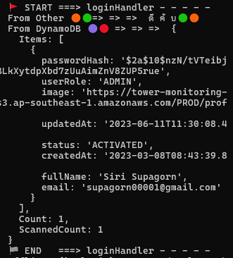

<!-- Title -->

<br>
<br>
<div align="center">
  
  <p>By Waraporn Promnongsan</p>
</div>
<br>

## Problem that caused this project

Team `[backend]` every time they start project and collect data with `DynamoDB` they have a page that has a `collection functions to do someting with DynamoDB` But when doing this in many projects , and functions is is edited , it must be followed up and edited in every project for `[backend]` , causing difficulty and the information is not consistent

Advantages :

- It would be very helpful if we could make the `backend function` we use more flexible. It becomes a `npm package` that can be downloaded from the same place

- Because if corrections occur, they will be able Can be `edited in one spot`

<br>

## About the project

Building and publishing backend function to `Node Package Manager(NPM)` easy to share and reuse code useful in projects , this article will guide you through the steps of building and `publishing` NPM package.

<br>

## Prerequisites

- [NPM account](https://www.npmjs.com)
- Docker
- NodeJS
- GitHub for clone , push and others
- Basic understanding of JavaScript / TypeScript

<br>

## Project structure

```sh
    .
    ├── dist                          # compiled folder for `publish` to npm
    ├── node_modules                  # package to use in project
    ├── src                           # important folder
    │   ├── components                # components folder for usage
    │   │   ├── dynamoDB.ts           # collect function to call DynamoDB
    │   │   ├── index.ts              # file to import all function and export
    │   │   ├── other.ts              # collect function basic
    │   └── index.tsx                 # calling function to test
    ├── docker-compose.yml            # docker compose file to start project
    ├── package.json                  # package.json to script command
    ├── tsconfig.json                 # tsconfig.json to setting script command
    └──
```

<br>

## 📢 Getting started - `Building & Publishing` NPM Package

1.) Clone the repo

```sh
git clone _ _ _
```

2.) Open 2 terminals

- 2.1 ) Terminal 1 : keep running `npm run dev`

```sh
$ docker compose up
```

- 2.2 ) Terminal 2 : bash in to `npm-be` container for use npm & script command

```sh
$ sudo docker exec -it npm-be bash
```

3.) Register new function and Implements at

```sh
  .
  ├── dynamoDB.ts                     # collect function to call DynamoDB
  ├── index.ts                        # file to import all function and export
  ├── other.ts                        # collect function basic
  └──
```

4.) Use command to create compiled folder `dist` to publish to `NPM`

```sh
npm run build
```

5.) Before publish to `NPM` you need to login in command

- Login into Gmail waiting to receive 6 digit code
- Promp command below `npm login` . . . it will return url to replace digit code
- Open Gmail copy _digit code_ and replace in website
- And press enter , command will say ( Logged in ✔ )

```sh
npm login
```

6.) Use command to publish `NPM` package

```sh
npm publish
```

7.) Let check in
https://www.npmjs.com your profile

<br>

## ⚙ Getting started - `Using` NPM Package

1.) Download `NPM` Package

```sh
npm i npm-components-aws-be
```

2.) Calling tools from package that we did (Follow Images)

<div align="left">
  
  <br>
  
  <br>
  
</div>

<br>

## Contact

Top , Waraporn Promnongsan

<br>

## Acknowledgments

Thankyou for all tutorials

- [Build & Publish React component as NPM package using Typescript compiler](https://blog.anoopjadhav.in/part-1-build-publish-react-component-as-npm-package-using-typescript-compiler)

- [A Step-by-Step Guide to Publishing Your Own React NPM Package](https://blog.nonstopio.com/a-step-by-step-guide-to-publishing-your-own-react-npm-package-fa2b7f1d149)

- [How to Build and Publish Your First React NPM Package](https://dev.to/femi_akinyemi/how-to-build-and-publish-your-first-react-npm-package-24o3)

- [How to package your React Component for distribution via NPM](https://itnext.io/how-to-package-your-react-component-for-distribution-via-npm-d32d4bf71b4f)

- [How to Publish a React Component as a Package to Npm](https://hackernoon.com/how-to-publish-a-react-component-as-a-package-to-npm)
